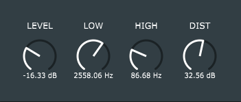

Distortion
==========

A distortion-plugin made with JUCE (v5.4.3). The distortion effect is made with a waveshaping function (tanh) and the plugin has two filters, a highpass filter before the waveshaping function ("HIGH") and lowpass filter after it ("LOW"). The plugin also includes controls for input volume ("DIST") and output volume ("LEVEL")

	

